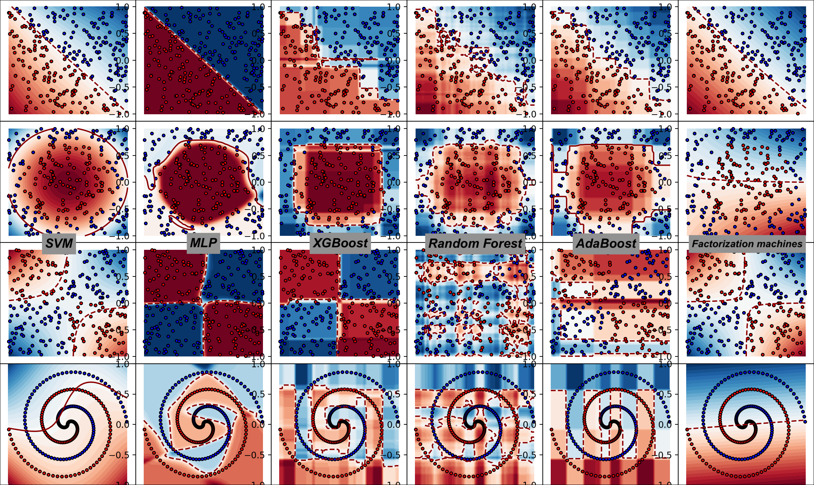

# Simple-Implementation-of-ML-Algorithms
My simplest implementations of common ML algorithms from scratch.
- For an easy understanding, most of the codes implements only minimal versin of the algorithm.
- The implementation uses only numpy.
- Most algorithms are within 100 lines of codes.

Also see decision boundary visualization for implemented classifiers in decision_boundary_vis.py

Implemented algorithms:

* Regression Models
    * Ridge Regression
        * Matrix solver
        * SGD/Adam solver
    * Logistic Regression
        * Multi-class prediction
    * Factorization Machines
        * Regularization
        * Classification/regression

* Bayes Models
    * Naive Bayes
        * Multinomial model
        * Document tokenizer
    * Beyasian Network
        * Conditional probability MLE
        * Beyasian inference

* Tree Models and Ensemble Learning
    * Decision Tree
        * Classification/regression
        * Different metrics
        * Feature importances
        * Sample weights
    * Random Forest
    * Adaboost
    * Gradient Boost Decision Tree
        * Shrinkage
        * Line search of multiplier
    * XGBoost
        * XGBoost Regression Tree
        * Shrinkage

* Deep Learning Techniques
    * Layers
        * Feedforward layer (dense)
        * Convolutional layer
        * Max pooling layer
        * Batch normalization layer
        * Softmax layer for classification
        * Activation layer
            * ReLU
            * Tanh
            * Sigmoid
        * WIP: Drop out layer
    * Mini Batch
    * He initialization
    * Loss functions
        * Squared error
        * Cross entropy
    * Regularization
        * L1
        * L2
    * Gradient check

* Deep Learning Architecture
    * Multilayer Perceptron
    * Restricted Boltzman Machine
    * Deep Belief Network
    * Variational autoencoder (VAE)
    * Convolutional Neural Network
        * Convolutional layer with vectorized img2col and col2img
    * Recurrent neural network
        * Backpropagation through time (BPTT)
    * Long short-term memory
    * Generative Adversarial Networks (GAN)

* Optimization Algorithms (See implementations in MLP or Regression)
	* Stochastic Gradient Descent
	* Gradient Descent with Momentum
	* Nesterov Momentum
	* AdaGrad
	* RMSProp
	* Adam

* k-Nearest Neighbors

* Support Vector Machine
    * Soft boundary
    * SMO algorithm
    * Different heuristics for selecting pairs in SMO

* Genetic Algorithm
    * Training a NN model
    * Selection by Fitness
    * Crossover approaches
    * Mutation rate

* Hidden Markov Model
    * Fitting by Baum-Welch
    * Prediction by Viterbi

Work in progress:
* Deep Q-Network (Reinforcement learning)

Feel free to use the code. Please contact me if you have any question: xiecng [at] gmail.com