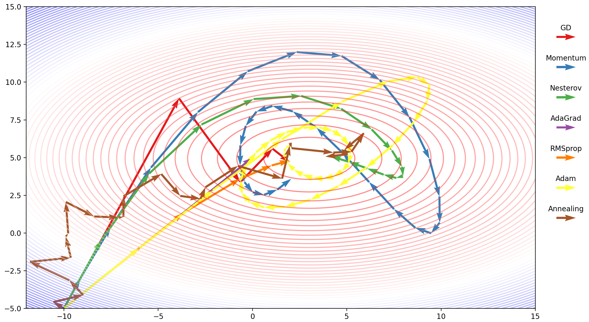
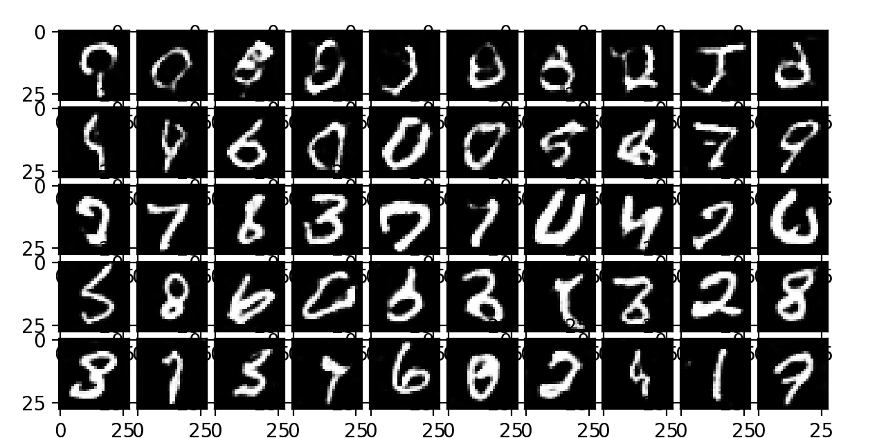
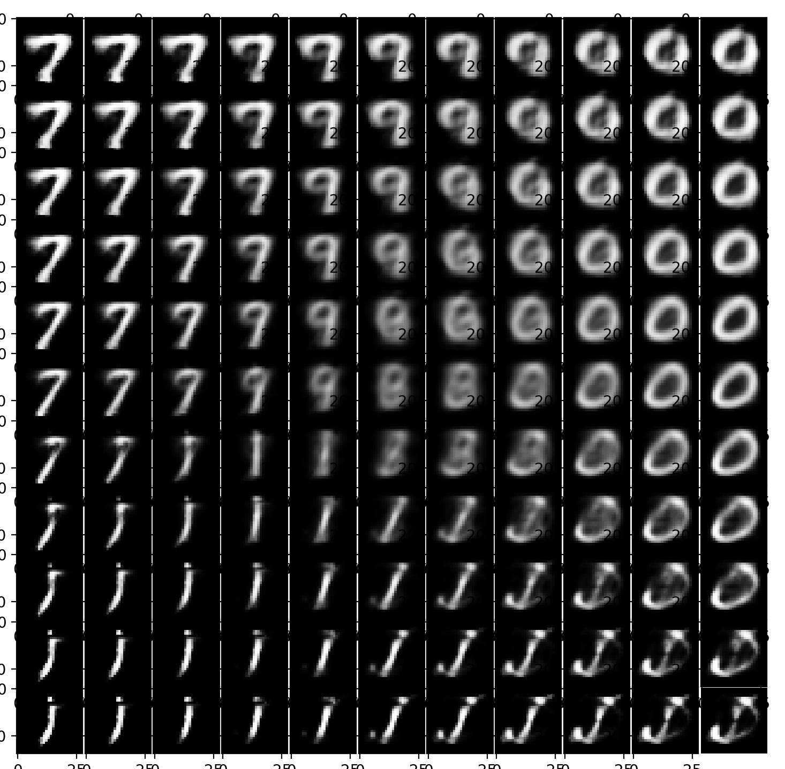
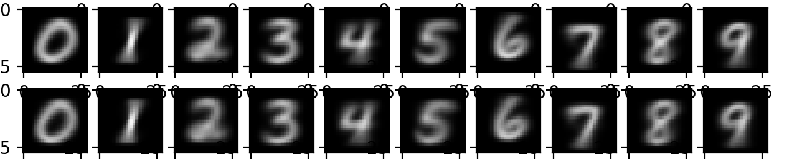

# Simple-Implementation-of-ML-Algorithms
### My simplest implementations of common ML algorithms from scratch.
* Most commonly used algorithms in Deep Learning, Ensemble Learning, Reinforcement Learning, Optimization Algorithms, Swarm Intelligence Algorithm, and other basic ML algorithms (see below list for more details).
* For an easy understanding, most of the codes implements only minimal version of the algorithm.
* The implementation uses only numpy.
* Most algorithms are within 100 lines of codes.

### Example Output
* Decision boundary visualization for implemented classifiers in `decision_boundary_visualization.py`

* Optimization process visualization in `optimization_visualization.py`: 

* digit images from the generative models trained with MNIST dataset:
    * Deep Convolutional Generative Adversarial Network (DC GAN) in `generative_adversarial_network.py`: 

    * Variational Autoencoders (VAE) in `variational_autoencoder.py`: 
    
    * Restricted Boltzmann Machine (RBM) `restricted_boltzman_machine.py`: 
    

### Implemented algorithms:

#### Regression Models
* Linear Regression `linear_regression.py`
    * Matrix solver
    * SGD/Adam solver
    * L1 regularization Lasso
    * L2 regularization Ridge
* Logistic Regression `logistic_regression.py`
    * Multi-class prediction
* Factorization Machines `factorization_machines.py`
    * Regularization
    * Classification/regression

#### Bayes Models
* Naive Bayes `naive_bayes.py`
    * Multinomial model
    * Document tokenizer
* Beyesian Network `beyesian_net.py`
    * Conditional probability MLE
    * Beyesian inference

#### Tree Models and Ensemble Learning
* Decision Tree `decision_tree.py`
    * Classification/regression
    * Different metrics
    * Feature importances
    * Sample weights
* Random Forest `random_forest.py`
* Adaboost `adaboost.py`
* Gradient Boosting Decision Tree (GBDT) `gradient_boosting_decision_tree.py`
    * Shrinkage
    * Line search of multiplier
* XGBoost `xgboost.py`
    * XGBoost Regression Tree
    * Shrinkage

#### Deep Learning
* Architecture
    * Supervised Model
        * Multilayer Perceptron (MLP) `multilayer_perceptron.py` / `simple_mlp.py`
        * Convolutional Neural Network (CNN) `convolutional_neural_network.py`
            * Convolutional layer with vectorized img2col and col2img
        * Recurrent neural network (RNN) `recurrent_neural_network.py`
            * Backpropagation through time (BPTT)
        * Long short-term memory (LSTM) `long_short_term_memory.py`
    * Generative Model
        * Restricted Boltzman Machine (RBM) `restricted_boltzman_machine.py`
        * Deep Belief Network (DBN) `deep_belief_network.py`
        * Variational autoencoder (VAE) `variational_autoencoder.py`
        * Generative Adversarial Network (GAN) `generative_adversarial_network.py`
    * Reinforcement Learning
        * Deep Q-Network (DQN) `deep_q_network.py`
* Layers `nn_layers.py` / `simple_cnn_layers.py`
    * Feedforward layer (dense)
    * Convolutional layer
    * Max pooling layer
    * Batch normalization layer
    * Softmax layer for classification
    * Activation layer
        * ReLU (Leaky)
        * Tanh (Leaky)
        * Sigmoid
    * Drop out layer (WIP)
* Training
    * Mini Batch
    * He initialization
    * Loss functions
        * Mean squared error for regression
        * Cross entropy for classification
        * Log loss for classification
    * L1/L2 Regularization
    * Gradient check

#### Optimization Algorithms `optimization_visualization.py` / `multilayer_perceptron.py`
* Stochastic Gradient Descent
* Gradient Descent with Momentum
* Nesterov Momentum
* AdaGrad
* RMSProp
* Adam
* Annealing Simulation

#### Other Supervised Models
* k-Nearest Neighbors (kNN) `k_nearest_neighbors.py`
* Support Vector Machine (SVM) `support_vector_machine.py`
    * Soft boundary
    * SMO algorithm
    * Different heuristics for selecting pairs in SMO

#### Swarm Intelligence
* Evolutionary / Genetic Algorithm (EA) `evolutionary_algorithm.py`
    * Training a NN model
    * Selection by Fitness
    * Crossover approaches
    * Mutation rate
* Particle Swarm Optimization (PSO) (WIP)
* Differential Evolution (DE) (WIP)
* Ant Colony Optimization (ACO) (WIP)

#### Markov Model
* Hidden Markov Model `hidden_markov_model.py`
    * Fitting by Baum-Welch
    * Prediction by Viterbi

#### Heuristic Search
* Monte Carlo tree search `monte_carlo_tree_search.py`
    * Upper Confidence Bound 1 applied to trees (UCT)
* Minimax `minimax.py`

Feel free to use the code. Please contact me if you have any question: xiecng [at] gmail.com